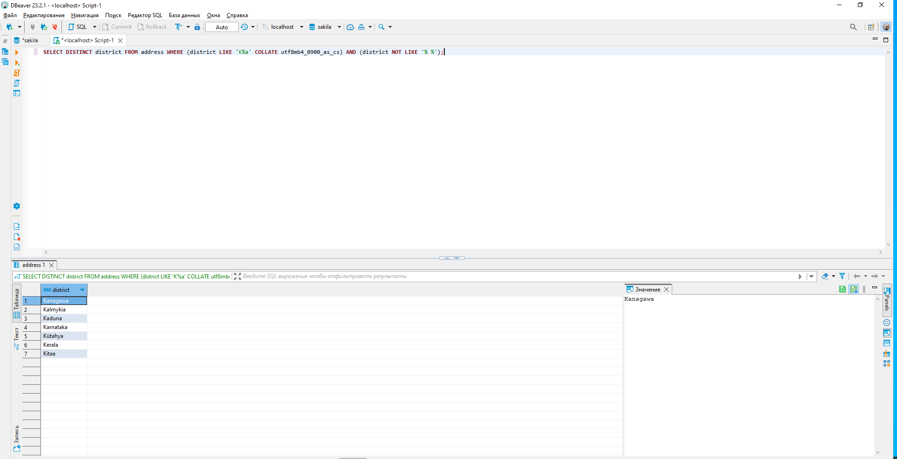
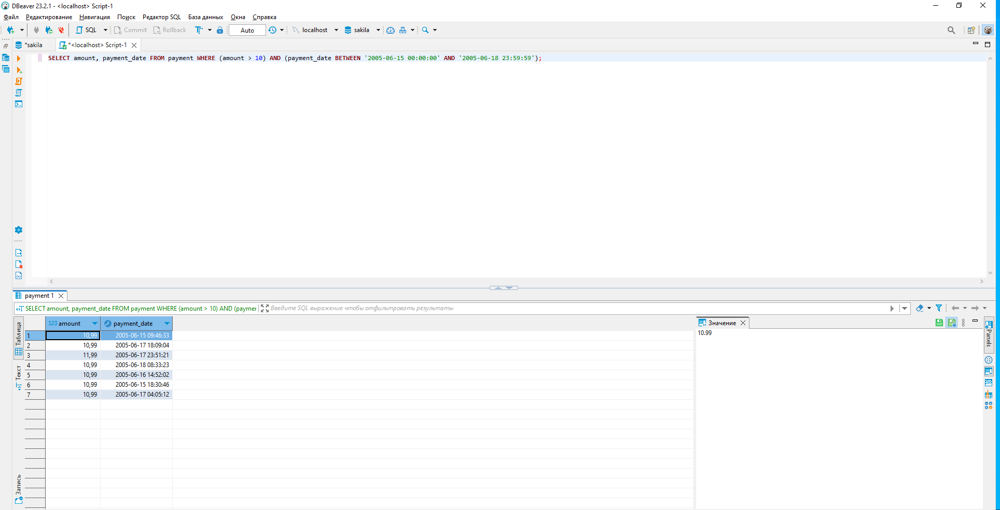
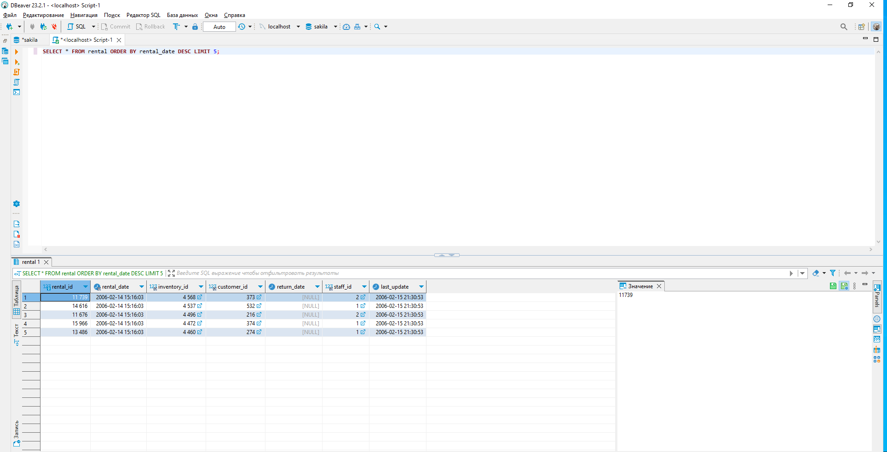
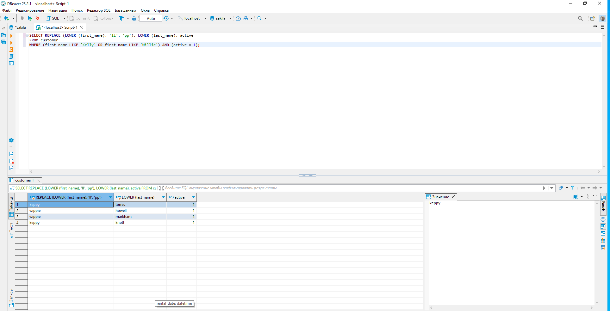

# Домашнее задание к занятию «SQL. Часть 1» Важинский ВС

Задание можно выполнить как в любом IDE, так и в командной строке.

### Задание 1

Получите уникальные названия районов из таблицы с адресами, которые начинаются на “K” и заканчиваются на “a” и не содержат пробелов.

```sql
SELECT DISTINCT district FROM address WHERE (district LIKE 'K%a' COLLATE utf8mb4_0900_as_cs) AND (district NOT LIKE '% %');
```


### Задание 2

Получите из таблицы платежей за прокат фильмов информацию по платежам, которые выполнялись в промежуток с 15 июня 2005 года по 18 июня 2005 года **включительно** и стоимость которых превышает 10.00.

```sql
SELECT amount, payment_date FROM payment WHERE (amount > 10) AND (payment_date BETWEEN '2005-06-15 00:00:00' AND '2005-06-18 23:59:59');
```


### Задание 3

Получите последние пять аренд фильмов.

```sql
SELECT * FROM rental ORDER BY rental_date DESC LIMIT 5;
```


### Задание 4

Одним запросом получите активных покупателей, имена которых Kelly или Willie. 

Сформируйте вывод в результат таким образом:
- все буквы в фамилии и имени из верхнего регистра переведите в нижний регистр,
- замените буквы 'll' в именах на 'pp'.

```sql
SELECT REPLACE (LOWER (first_name), 'll', 'pp'), LOWER (last_name), active
FROM customer
WHERE (first_name LIKE 'Kelly' OR first_name LIKE 'Willie') AND (active = 1);
```

