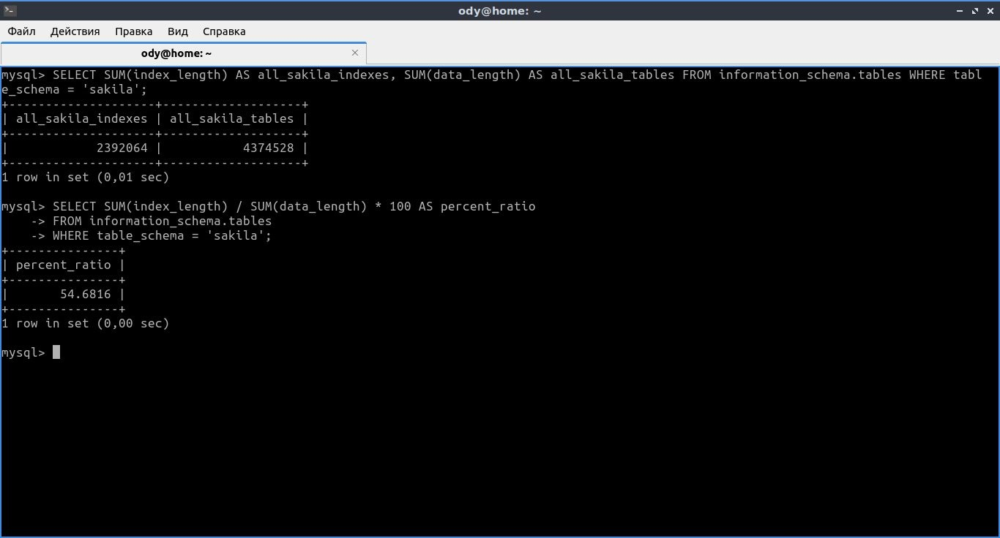
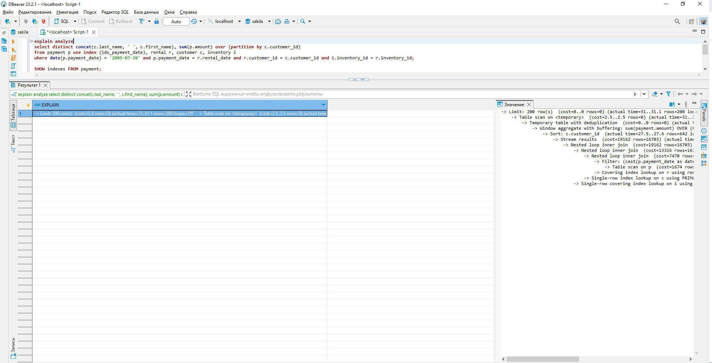

# Домашнее задание к занятию «Индексы» Важинский ВС

### Задание 1

Напишите запрос к учебной базе данных, который вернёт процентное отношение общего размера всех индексов к общему размеру всех таблиц.

```sql
SELECT SUM(index_length) / SUM(data_length) * 100 AS percent_ratio
FROM information_schema.tables
WHERE table_schema = 'sakila';
```



### Задание 2

Выполните explain analyze следующего запроса:
```sql
select distinct concat(c.last_name, ' ', c.first_name), sum(p.amount) over (partition by c.customer_id, f.title)
from payment p, rental r, customer c, inventory i, film f
where date(p.payment_date) = '2005-07-30' and p.payment_date = r.rental_date and r.customer_id = c.customer_id and i.inventory_id = r.inventory_id
```
- перечислите узкие места;
- оптимизируйте запрос: внесите корректировки по использованию операторов, при необходимости добавьте индексы.

---

- Выполнение EXPLAIN ANALYZE запроса из задания и сам запрос:

```sql
EXPLAIN analyze
select distinct concat(c.last_name, ' ', c.first_name), sum(p.amount) over (partition by c.customer_id, f.title)
from payment p, rental r, customer c, inventory i, film f
where date(p.payment_date) = '2005-07-30' and p.payment_date = r.rental_date and r.customer_id = c.customer_id and i.inventory_id = r.inventory_id;
```


- Выполнение EXPLAIN ANALYZE оптимизированного запроса и сам запрос:

```sql
EXPLAIN analyze
select distinct concat(c.last_name, ' ', c.first_name), sum(p.amount) over (partition by c.customer_id)
from payment p, rental r, customer c, inventory i
where date(p.payment_date) = '2005-07-30' and p.payment_date = r.rental_date and r.customer_id = c.customer_id and i.inventory_id = r.inventory_id;
```


- Проверка существующих индексов:


- Создание индекса idx_payment_date для поля payment_date таблицы payment:

```sql
CREATE INDEX idx_payment_date ON payment(payment_date);
```


- Проверка использования созданного индекса при выполнении запроса с помощью EXPLAIN:


- Скорректированный запрос, его выполнение, проверка использования индекса помощью EXPLAIN и выполнение EXPLAIN ANALYZE:

```sql
EXPLAIN
select distinct concat(c.last_name, ' ', c.first_name), sum(p.amount) over (partition by c.customer_id)
from payment p use index (idx_payment_date), rental r, customer c, inventory i
where date(p.payment_date) = '2005-07-30' and p.payment_date = r.rental_date and r.customer_id = c.customer_id and i.inventory_id = r.inventory_id;
```




