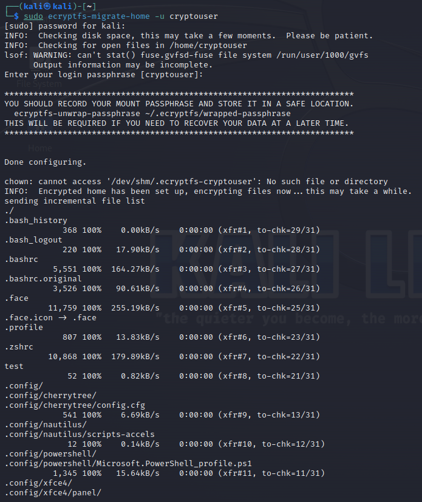

# Домашнее задание к занятию  «Защита хоста»

### Задание 1

1. Установите **eCryptfs**.
2. Добавьте пользователя cryptouser.
3. Зашифруйте домашний каталог пользователя с помощью eCryptfs.


*В качестве ответа  пришлите снимки экрана домашнего каталога пользователя с исходными и зашифрованными данными.*  

---

Установка eCryptfs:


Создание пользователя cryptouser:


Шифрование домашнего каталога пользователя с помощью eCryptfs:

```
sudo ecryptfs-migrate-home -u cryptouser
```



Проверка домашнего каталога пользователя cryptouser с исходными и зашифрованными данными:


### Задание 2

1. Установите поддержку **LUKS**.
2. Создайте небольшой раздел, например, 100 Мб.
3. Зашифруйте созданный раздел с помощью LUKS.

*В качестве ответа пришлите снимки экрана с поэтапным выполнением задания.*

---

Подготовка диска:

```
sudo apt install gparted
```

Установка LUKS и проверка установки:

```
sudo apt-get install cryptsetup
cryptsetup --version
```

Вывод информации о разделах:


Шифрование созданного раздела с помощью LUKS:
- Подготовка раздела:

```
sudo cryptsetup -y -v --type luks2 luksFormat /dev/sdb1
```


- Монтирование раздела:

```
sudo cryptsetup luksOpen /dev/sdb1 disk
 ls /dev/mapper/disk
```


- Форматирование раздела:

```
sudo dd if=/dev/zero of=/dev/mapper/disk
sudo mkfs.ext4 /dev/mapper/disk
```


- Монтирование «открытого» раздела:

```
mkdir .secret
sudo mount /dev/mapper/disk .secret/
```


- Завершение работы:

```
sudo umount .secret
sudo cryptsetup luksClose disk
```


