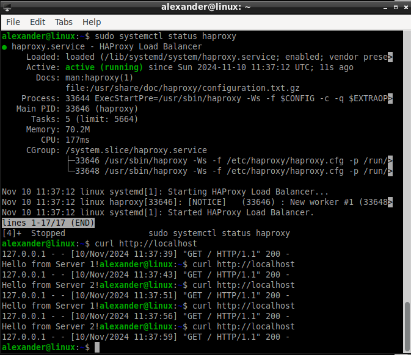
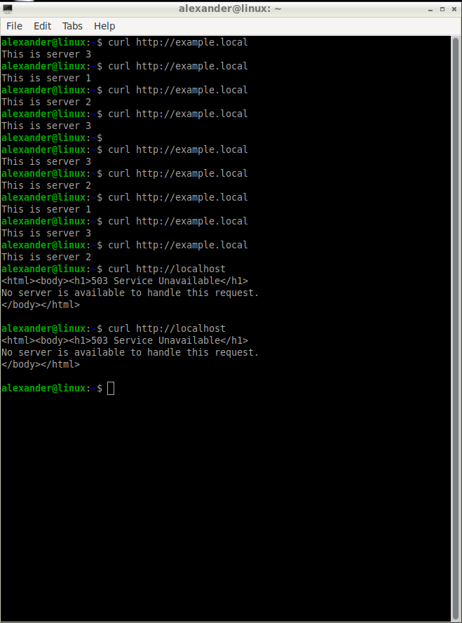

# Домашнее задание к занятию "«Кластеризация и балансировка нагрузки»" - `Важинский Виктор`
-- 

### Инструкция по выполнению домашнего задания

   1. Сделайте `fork` данного репозитория к себе в Github и переименуйте его по названию или номеру занятия, например, https://github.com/имя-вашего-репозитория/git-hw или  https://github.com/имя-вашего-репозитория/7-1-ansible-hw).
   2. Выполните клонирование данного репозитория к себе на ПК с помощью команды `git clone`.
   3. Выполните домашнее задание и заполните у себя локально этот файл README.md:
      - впишите вверху название занятия и вашу фамилию и имя
      - в каждом задании добавьте решение в требуемом виде (текст/код/скриншоты/ссылка)
      - для корректного добавления скриншотов воспользуйтесь [инструкцией "Как вставить скриншот в шаблон с решением](https://github.com/netology-code/sys-pattern-homework/blob/main/screen-instruction.md)
      - при оформлении используйте возможности языка разметки md (коротко об этом можно посмотреть в [инструкции  по MarkDown](https://github.com/netology-code/sys-pattern-homework/blob/main/md-instruction.md))
   4. После завершения работы над домашним заданием сделайте коммит (`git commit -m "comment"`) и отправьте его на Github (`git push origin`);
   5. Для проверки домашнего задания преподавателем в личном кабинете прикрепите и отправьте ссылку на решение в виде md-файла в вашем Github.
   6. Любые вопросы по выполнению заданий спрашивайте в чате учебной группы и/или в разделе “Вопросы по заданию” в личном кабинете.
   
Желаем успехов в выполнении домашнего задания!
   
### Дополнительные материалы, которые могут быть полезны для выполнения задания

1. [Руководство по оформлению Markdown файлов](https://gist.github.com/Jekins/2bf2d0638163f1294637#Code)

---
### Задание 1



То что добавил к стандартному haproxy.cfg:

```

frontend http_front
    bind *:80
    default_backend servers

backend servers
    balance roundrobin
    server server1 127.0.0.1:8001 check
    server server2 127.0.0.1:8002 check

```


### Задание 2



haproxy.cfg:

```
global
    log /dev/log local0
    log /dev/log local1 notice
    chroot /var/lib/haproxy
    stats socket /run/haproxy/admin.sock mode 660 level admin
    stats timeout 30s
    user haproxy
    group haproxy
    daemon
    maxconn 256

defaults
    log     global
    mode    http
    option  httplog
    option  dontlognull
    timeout connect 5s
    timeout client  50s
    timeout server  50s
    retries 3

frontend http_in
    bind *:80
    acl host_example hdr(host) -i example.local
    use_backend http_back if host_example
    default_backend http_default

backend http_back
    mode http
    balance roundrobin
    option httpchk GET /
    server server1 127.0.0.1:8001 weight 2 check
    server server2 127.0.0.1:8002 weight 3 check
    server server3 127.0.0.1:8003 weight 4 check

backend http_default
    mode http
    errorfile 503 /etc/haproxy/errors/503.http

```


