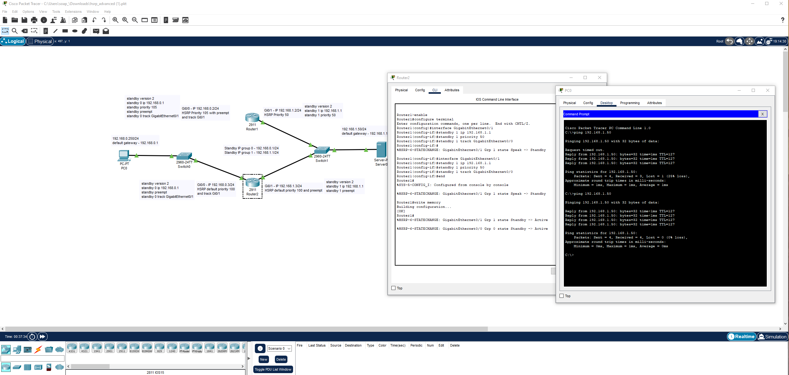
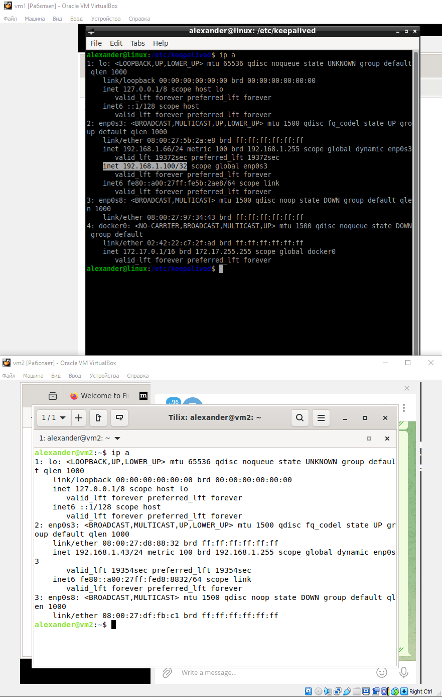
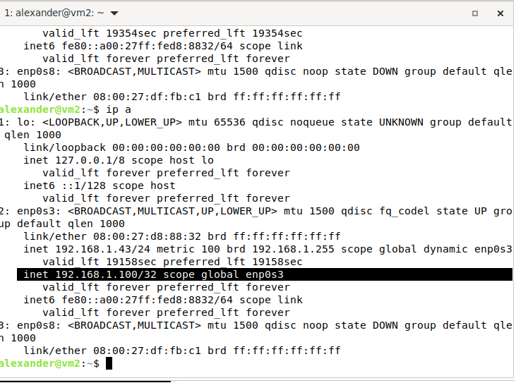
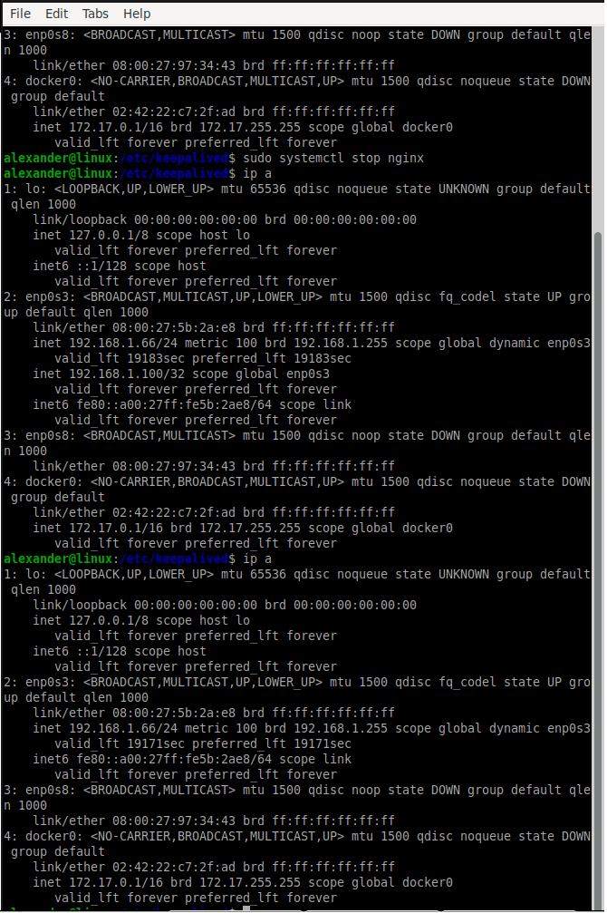

# Домашнее задание к занятию "«Disaster Recovery. FHRP и Keepalived»" - `Важинский Виктор`
-- 

### Инструкция по выполнению домашнего задания

   1. Сделайте `fork` данного репозитория к себе в Github и переименуйте его по названию или номеру занятия, например, https://github.com/имя-вашего-репозитория/git-hw или  https://github.com/имя-вашего-репозитория/7-1-ansible-hw).
   2. Выполните клонирование данного репозитория к себе на ПК с помощью команды `git clone`.
   3. Выполните домашнее задание и заполните у себя локально этот файл README.md:
      - впишите вверху название занятия и вашу фамилию и имя
      - в каждом задании добавьте решение в требуемом виде (текст/код/скриншоты/ссылка)
      - для корректного добавления скриншотов воспользуйтесь [инструкцией "Как вставить скриншот в шаблон с решением](https://github.com/netology-code/sys-pattern-homework/blob/main/screen-instruction.md)
      - при оформлении используйте возможности языка разметки md (коротко об этом можно посмотреть в [инструкции  по MarkDown](https://github.com/netology-code/sys-pattern-homework/blob/main/md-instruction.md))
   4. После завершения работы над домашним заданием сделайте коммит (`git commit -m "comment"`) и отправьте его на Github (`git push origin`);
   5. Для проверки домашнего задания преподавателем в личном кабинете прикрепите и отправьте ссылку на решение в виде md-файла в вашем Github.
   6. Любые вопросы по выполнению заданий спрашивайте в чате учебной группы и/или в разделе “Вопросы по заданию” в личном кабинете.
   
Желаем успехов в выполнении домашнего задания!
   
### Дополнительные материалы, которые могут быть полезны для выполнения задания

1. [Руководство по оформлению Markdown файлов](https://gist.github.com/Jekins/2bf2d0638163f1294637#Code)

---
### Задание 1





### Задание 2




keepalived.conf

```
vrrp_script chk_web_server {
    script "/usr/local/bin/check_web_server.sh"
    interval 3
    fall 2
    rise 2
}

vrrp_instance VI_1 {
    state MASTER
    interface enp0s3                
    virtual_router_id 51           
    priority 100                   
    advert_int 1

    virtual_ipaddress {
        192.168.1.100              
    }

    track_script {
        chk_web_server
    }
}
```

check_web_server.sh

```
#!/bin/bash

SERVER_IP="127.0.0.1"
SERVER_PORT=80
INDEX_FILE="/var/www/html/index.html"

nc -z "$SERVER_IP" "$SERVER_PORT"
if [ $? -ne 0 ]; then
    exit 1
fi

if [ ! -f "$INDEX_FILE" ]; then
    exit 1
fi

exit 0

```


